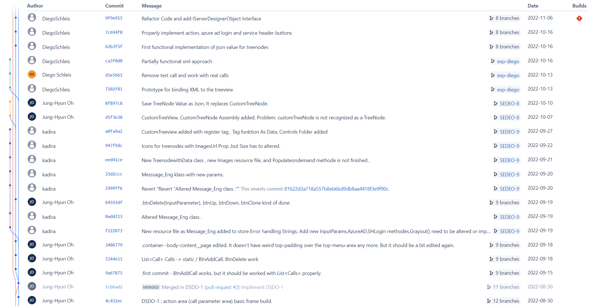

# Individuelle Themenstellung

## Windows Forms (8 Seiten)

### Was ist Windows Forms?

Windows Forms (WinForms) ist eine grafische Benutzeroberflächenbibliothek, die erstmals mit dem .NET Framework 1.0 veröffentlicht, das im Februar 2002 eingeführt wurde. 

Es wird verwendet, um Desktopanwendungen für das Windows-Betriebssystem zu erstellen.

Windows Forms stellt eine breite Palette von Steuerelementen zur Verfügung, wie z.B. Buttons, Textboxen, Dropdown-Menüs und weitere, die auf einem Formular platziert und dann programmiert werden können, um spezifische Funktionen auszuführen. 
Mit Windows Forms können Entwickler auch Dialogboxen, Menüs und Toolbars erstellen.

Windows Forms-Anwendungen werden in einer ereignisgesteuerten Programmierweise geschrieben.
Das bedeutet, dass der Code auf Benutzerinteraktionen reagiert, wie z.B. Mausklicks oder Tastendrücke.

Obwohl Windows Forms seit mehreren Jahren eine beliebte Wahl für die Erstellung von Windows-Desktopanwendungen ist, hat Microsoft eine neuere Technologie namens Windows Presentation Foundation (WPF) eingeführt, die mehr Flexibilität und die Möglichkeit für anspruchsvollere Grafiken bietet. 
Zudem wird seit einigen Jahren die plattformübergreifende .NET-Core- bzw. .NET-5/6-Technologie von Microsoft intensiv weiterentwickelt, die unter anderem mit dem UI-Framework Blazor auch moderne Webanwendungen ermöglicht. 
Dennoch wird Windows Forms immer noch in vielen Anwendungsfällen verwendet, insbesondere in Geschäftsanwendungen und bei bestehenden Projekten.

Quelle: https://chat.openai.com/?model=gpt-4, abgerufen am 26.5.2023

### Eventhandling in Windows Forms.

Eventhandling in Windows Forms basiert auf dem Konzept des Delegierens und Ereignissen (Events). 
Wenn ein bestimmtes Ereignis, wie z.B. ein Mausklick, auftritt, löst das entsprechende Steuerelement (Control) ein Ereignis aus, das dann von einer Ereignisbehandlungsmethode (Event Handler) verarbeitet wird, die von Ihnen definiert wird.

Hier ist ein einfaches Beispiel, wie man einen Button in Windows Forms erstellen und ein Ereignis behandeln können. 
Dieses Beispiel wird in C# geschrieben:

```csharp
using System;
using System.Windows.Forms;

public class MyForm : Form
{
    Button button1;

    public MyForm()
    {
        button1 = new Button();
        button1.Text = "Click me!";
        button1.Click += new EventHandler(button1_Click);
        
        Controls.Add(button1);
    }

    private void button1_Click(object sender, EventArgs e)
    {
        MessageBox.Show("Button clicked!");
    }   

    [STAThread]
    static void Main()
    {
        Application.EnableVisualStyles();
        Application.Run(new MyForm());
    }
}

```

In diesem Beispiel wird ein Button button1 erstellt. Das Ereignis Click des Buttons wird dann mit der Methode *button1_Click* verknüpft, indem wir einen neuen EventHandler hinzufügen. 
Der EventHandler nimmt zwei Parameter: den Sender des Ereignisses (in diesem Fall der Button selbst) und ein EventArgs-Objekt, das weitere Informationen über das Ereignis enthält (für ein Click-Ereignis sind dies in der Regel keine).

Die Methode *button1_Click* wird aufgerufen, wenn das Click-Ereignis des Buttons ausgelöst wird, also wenn der Benutzer auf den Button klickt. 
In der Ereignisbehandlungsmethode zeigen wir dann eine Nachrichtenbox an, die "Button clicked!" ausgibt.

Der Code in der Main Methode stellt sicher, dass die Anwendung ausgeführt wird und das Formular angezeigt wird, wenn das Programm gestartet wird.

Quelle: https://chat.openai.com/?model=gpt-4, abgerufen am 26.5.2023

### Die Parameter object sender und EventArgs e

**object sender:** Dieser Parameter enthält eine Referenz auf das Objekt, das das Ereignis ausgelöst hat. Beispielsweise, wenn ein Button angeklickt wurde und dadurch ein Click-Ereignis ausgelöst hat, dann ist das sender-Objekt eine Referenz auf diesen speziellen Button. Es wird üblicherweise zu dem entsprechenden Typ gecastet, um auf spezifische Eigenschaften oder Methoden des auslösenden Objekts zugreifen zu können.

**EventArgs e:** Dieser Parameter enthält zusätzliche Ereignis-spezifische Informationen. Für viele Ereignisse, einschließlich der meisten UI-Events wie Click, gibt es nicht wirklich zusätzliche Informationen, die übermittelt werden müssen, und so ist der EventArgs-Parameter oft einfach ein leerer EventArgs-Wert oder null. Bei einigen anderen Ereignissen, zum Beispiel MouseMove, enthält der EventArgs-Parameter nützliche Informationen. In diesem Fall wäre es eigentlich ein Objekt von einem Untertyp von EventArgs, wie MouseEventArgs, und es enthält Informationen wie die Position der Maus.

**[STAThread]-Annotation**
Die [STAThread]-Annotation in Windows Forms Anwendungen wird verwendet, um anzugeben, dass das COM-Threading-Modell der Anwendung ein Single-Threaded Apartment (STA) ist.<sup>[2]</sup> Diese Anweisung muss am Einstiegspunkt jeder Windows Forms-Anwendung vorhanden sein. Die Anweisung wird tatsächlich von der .NET-Laufzeit beim Starten der Anwendung gelesen, um zu entscheiden, wie die COM-Threading-Umgebung initialisiert werden soll.

[2]: https://chat.openai.com/?model=gpt-4, abgerufen am 26.5.2023

### GUI Elemente in Windows Forms.

Windows Forms bietet eine Vielzahl von GUI-Elementen, die auch als Steuerelemente oder Controls bekannt sind. Hier sind einige Beispiele, die im bestehenden Projekt verwendet wurden. 

1. Button: Ein klickbares Steuerelement, das eine Aktion auslöst, wenn es angeklickt wird.
   
```csharp
public class Button : System.Windows.Forms.ButtonBase, System.Windows.Forms.IButtonControl

private void InitializeMyButton()
 {
    // Create and initialize a Button.
    Button button1 = new Button();
 
    // Set the button to return a value of OK when clicked.
    button1.DialogResult = DialogResult.OK;
 
    // Add the button to the form.
    Controls.Add(button1);
 }
```
2. Label: Ein Steuerelement, das dazu dient, Text auf der Benutzeroberfläche anzuzeigen.
```csharp
[System.ComponentModel.DefaultBindingProperty("Text")]
public class Label : System.Windows.Forms.Control, System.Windows.Forms.Automation.IAutomationLiveRegion

public void CreateMyLabel()
{
   // Create an instance of a Label.
   Label label1 = new Label();

   // Set the border to a three-dimensional border.
   label1.BorderStyle = System.Windows.Forms.BorderStyle.Fixed3D;
   // Set the ImageList to use for displaying an image.
   label1.ImageList = imageList1;
   // Use the second image in imageList1.
   label1.ImageIndex = 1;
   // Align the image to the top left corner.
   label1.ImageAlign = ContentAlignment.TopLeft;

   // Specify that the text can display mnemonic characters.
   label1.UseMnemonic = true;
   // Set the text of the control and specify a mnemonic character.
   label1.Text = "First &Name:";
   
   /* Set the size of the control based on the PreferredHeight and PreferredWidth values. */
   label1.Size = new Size (label1.PreferredWidth, label1.PreferredHeight);

   //...Code to add the control to the form...
}
```
3. TextBox: Erlaubt dem Benutzer, Text einzugeben.
```csharp
public class TextBox : System.Windows.Forms.TextBoxBase

using System;
using System.Collections.Generic;
using System.ComponentModel;
using System.Data;
using System.Drawing;
using System.Linq;
using System.Text;
using System.Windows.Forms;

public class Form1 : Form
{
    private TextBox textBox1;

    public Form1()
    {
        InitializeComponent();
    }

    private void InitializeComponent()
    {
        this.textBox1 = new System.Windows.Forms.TextBox();
        this.SuspendLayout();
        // 
        // textBox1
        // 
        this.textBox1.AcceptsReturn = true;
        this.textBox1.AcceptsTab = true;
        this.textBox1.Dock = System.Windows.Forms.DockStyle.Fill;
        this.textBox1.Multiline = true;
        this.textBox1.ScrollBars = System.Windows.Forms.ScrollBars.Vertical;
        // 
        // Form1
        // 
        this.ClientSize = new System.Drawing.Size(284, 264);
        this.Controls.Add(this.textBox1);
        this.Text = "TextBox Example";
        this.ResumeLayout(false);
        this.PerformLayout();
    }

    [STAThread]
    static void Main()
    {
        Application.EnableVisualStyles();
        Application.SetCompatibleTextRenderingDefault(false);
        Application.Run(new Form1());
    }
}
```
4. Panel: Ein Container, in dem andere Steuerelemente platziert werden können.
```csharp
[System.Windows.Forms.Docking(System.Windows.Forms.DockingBehavior.Ask)]
public class Panel : System.Windows.Forms.ScrollableControl

public void CreateMyPanel()
{
   Panel panel1 = new Panel();
   TextBox textBox1 = new TextBox();
   Label label1 = new Label();
   
   // Initialize the Panel control.
   panel1.Location = new Point(56,72);
   panel1.Size = new Size(264, 152);
   // Set the Borderstyle for the Panel to three-dimensional.
   panel1.BorderStyle = System.Windows.Forms.BorderStyle.Fixed3D;

   // Initialize the Label and TextBox controls.
   label1.Location = new Point(16,16);
   label1.Text = "label1";
   label1.Size = new Size(104, 16);
   textBox1.Location = new Point(16,32);
   textBox1.Text = "";
   textBox1.Size = new Size(152, 20);

   // Add the Panel control to the form.
   this.Controls.Add(panel1);
   // Add the Label and TextBox controls to the Panel.
   panel1.Controls.Add(label1);
   panel1.Controls.Add(textBox1);
}
```
5. DataGridView: Zeigt Daten in tabellarischer Form an.
```csharp
using System;
using System.Windows.Forms;
using System.Data;

namespace WindowsFormsApplication1
{
    public partial class Form1 : Form
    {
        public Form1()
        {
            InitializeComponent();
        }

        private void Form1_Load(object sender, EventArgs e)
        {
            // Create a new DataTable instance.
            DataTable dt = new DataTable();

            // Add columns to the DataTable.
            dt.Columns.Add("UserID");
            dt.Columns.Add("UserName");
            dt.Columns.Add("UserEmail");

            // Add rows to the DataTable.
            dt.Rows.Add(1, "John Doe", "john.doe@example.com");
            dt.Rows.Add(2, "Jane Doe", "jane.doe@example.com");
            dt.Rows.Add(3, "Robert Smith", "robert.smith@example.com");

            // Assign the DataTable as the DataSource for the DataGridView.
            dataGridView1.DataSource = dt;
        }
    }
}
```


6. TreeView: Zeigt hierarchische Daten in einer Struktur mit Knoten an, die expandiert und              zusammengeklappt werden können.
```csharp
using System;
using System.Windows.Forms;

namespace WindowsFormsApplication1
{
    public partial class Form1 : Form
    {
        public Form1()
        {
            InitializeComponent();
        }

        private void Form1_Load(object sender, EventArgs e)
        {
            // Create root node
            TreeNode rootNode = new TreeNode("Root Node");
            treeView1.Nodes.Add(rootNode);

            // Create child nodes
            TreeNode childNode1 = new TreeNode("Child Node 1");
            TreeNode childNode2 = new TreeNode("Child Node 2");

            // Add child nodes to root node
            rootNode.Nodes.Add(childNode1);
            rootNode.Nodes.Add(childNode2);

            // Create subchild nodes
            TreeNode subChildNode1 = new TreeNode("Subchild Node 1");
            TreeNode subChildNode2 = new TreeNode("Subchild Node 2");

            // Add subchild nodes to child node 1
            childNode1.Nodes.Add(subChildNode1);
            childNode1.Nodes.Add(subChildNode2);
        }
    }
}
```

***Quelle*** 

Microsoft https://learn.microsoft.com/en-us/dotnet/api/
ChatGPT https://chat.openai.com/?model=gpt-4, abgerufen am 26.5.2023

## Erstellung eine GUI Mockups (8 Seiten/aber 5 Seiten)

### Warum ein Mockup?

Ein Mockup in der Softwareentwicklung ist eine Art von Prototyp, der dazu dient, das Design und die Funktionalität der Anwendung zu visualisieren. 
Es ist eine schematische Darstellung, die zeigt, wie die Software oder Website aussehen und funktionieren wird. Hier sind einige Gründe, warum ein Mockup in der Softwareentwicklung nützlich ist:

1. **Kommunikation und Visualisierung**: Mockups helfen dem Team und den Stakeholdern, ein besseres Verständnis davon zu bekommen, wie das fertige Produkt aussehen und funktionieren soll. 
Sie ermöglichen es den Entwicklern, ihre Ideen zu präsentieren und Feedback zu sammeln.

2. **Fehler frühzeitig erkennen**: Durch die Verwendung von Mockups können Probleme und Unstimmigkeiten im Design frühzeitig erkannt und korrigiert werden, bevor die tatsächliche Entwicklung beginnt.

3. **Effizienz**: Mit einem Mockup kann das Entwicklerteam Änderungen am Design testen und anpassen, ohne Code schreiben zu müssen. Das kann Zeit und Ressourcen sparen.

4. **Nutzererfahrung**: Ein Mockup kann genutzt werden, um die Benutzererfahrung zu testen und zu verbessern. Es kann dabei helfen, zu überprüfen, ob die geplante Anwendung benutzerfreundlich und intuitiv ist.

5. **Stakeholder-Einbindung**: Mockups sind besonders nützlich, um Stakeholder in den Entwicklungsprozess einzubeziehen. Sie ermöglichen es ihnen, die Fortschritte zu verfolgen und Feedback zu geben, was zu einem besseren Endprodukt führen kann.

<u>Es ist wichtig zu beachten, dass ein Mockup nicht die endgültige Version der Anwendung ist.</u> Es ist ein Werkzeug zur Planung und Kommunikation und kann und sollte auf Basis von Feedback und neuen Erkenntnissen angepasst werden.

***Quelle*** 
ChatGPT https://chat.openai.com/?model=gpt-4, abgerufen am 31.5.2023

### Möglichkeiten von Adobe XD.

Adobe XD, auch bekannt als Experience Design, stellt eine hochentwickelte Plattform für das Design und Prototyping von Benutzeroberflächen für Web- und mobile Anwendungen dar. Die folgende Auflistung präsentiert zentrale Funktionen und Merkmale von Adobe XD:

Design-Funktionen: Adobe XD bietet eine umfassende Auswahl an Design-Werkzeugen, die es ermöglichen, Benutzeroberflächen für diverse Geräte und Bildschirmgrößen zu gestalten. So ist das Erzeugen von Vektorgrafiken, das Importieren von Bildern, das Individualisieren von Farben und Schriftarten und vieles mehr möglich.

Prototyping: Mit Adobe XD lässt sich die Erstellung interaktiver Prototypen realisieren. Hiermit können Übergänge und Animationen definiert werden, um das Verhalten einer Anwendung zu simulieren. Dies ermöglicht eine Vorstellung davon, wie das Endprodukt aussehen und agieren könnte.

Interaktionen und Animationen: Adobe XD bietet die Möglichkeit, Mikrointeraktionen und Animationen zu entwickeln, die dazu beitragen können, die Benutzeroberfläche lebendiger und intuitiver zu gestalten.

Kollaboration: Adobe XD unterstützt die Zusammenarbeit zwischen Designern, Entwicklern und Stakeholdern. Es ermöglicht das Teilen von Designs und Prototypen, das Einholen von Rückmeldungen und das Umsetzen von Modifikationen in Echtzeit.

Integration: Adobe XD lässt sich mit anderen Adobe-Produkten und Tools von Drittanbietern integrieren, was den Design- und Entwicklungsprozess weiter optimieren kann.

Responsives Design: Mit Adobe XD können Designs erzeugt werden, die sich automatisch an verschiedene Bildschirmgrößen anpassen.

Benutzererfahrungstests: Adobe XD ermöglicht das Durchführen von Tests zur Benutzererfahrung, indem Prototypen mit realen Benutzern geteilt werden können. Die Aufzeichnung deren Interaktionen liefert wertvolles Feedback zur Verbesserung der Anwendung.

Es ist zu beachten, dass Adobe XD primär als Design- und Prototyping-Werkzeug konzipiert ist und nicht zur Erstellung von funktionsfähigem Code dient. Es ermöglicht die Visualisierung und Simulation des Designs und Verhaltens einer Anwendung, die eigentliche Codierung muss jedoch separat erfolgen.

***Quelle*** 
ChatGPT https://chat.openai.com/?model=gpt-4, abgerufen am 31.5.2023

### Umsetzung mit Adobe XD. 

Bild 1 : ein Übersicht zu allen Seiten


## Nutzung von Versionsverwaltungssystemen in der Entwicklung (5 Seiten/aber 10 Seiten) 

### Kommunikation mit dem Auftraggeber.

Die Kommunikation mit dem Auftraggeber (oder dem Kunden) ist ein wesentlicher Aspekt jedes Softwareentwicklungsprojekts. Hier sind einige Strategien und Best Practices, die helfen können:

1. Klare Kommunikation: Die Sprache sollte klar und ohne Fachjargon sein, es sei denn, der Kunde ist technisch versiert.

2. Regelmäßige Updates: Es ist wichtig, regelmäßige Updates und Fortschrittsberichte zu geben. Das hilft, den Kunden auf dem Laufenden zu halten und mögliche Überraschungen oder Fehlannahmen zu vermeiden.

3. Aktives Zuhören: Versuchen Sie, die Bedürfnisse und Anforderungen des Kunden vollständig zu verstehen. Stellen Sie Nachfragen, wenn Sie unsicher sind.

4. Feedback einholen: Lassen Sie den Kunden oft und früh das Produkt testen und Feedback geben. Dies ermöglicht es, frühzeitig Probleme zu erkennen und Korrekturen vorzunehmen.

5. Transparenz: Seien Sie offen und ehrlich über Herausforderungen, Probleme und Verzögerungen. Die meisten Kunden schätzen es, frühzeitig informiert zu werden, anstatt später unangenehme Überraschungen zu erleben.

6. Verwendung geeigneter Kommunikationskanäle: E-Mail, Videoanrufe, Telefonate, persönliche Meetings - je nach Situation und Kundenpräferenz kann der geeignete Kanal variieren.

7. Einrichtung regelmäßiger Meetings: Wöchentliche oder bi-wöchentliche Stand-up-Meetings sind oft nützlich, um die aktuelle Situation zu besprechen und mögliche Hindernisse zu identifizieren.

8. Verständnis und Respekt für die Geschäftsanforderungen des Kunden: Oft geht es nicht nur um die technische Lösung, sondern auch um Geschäftsziele, Zeitpläne und Budgets. Versuchen Sie, diese Faktoren zu verstehen und zu respektieren.

9. Verwendung von Projektmanagement- und Kollaborationstools: Tools wie Jira, Trello, Asana, Slack usw. können dabei helfen, die Kommunikation zu strukturieren und alle Beteiligten auf dem Laufenden zu halten.

10. Erstellung und Einhaltung eines Kommunikationsplans: Dieser sollte festlegen, wer wann mit wem kommuniziert und über welche Kanäle.

Diese Strategien helfen, eine positive Beziehung mit dem Kunden aufzubauen, was letztendlich zu einem erfolgreichen Projekt führt.

 ***Quelle***
 mindtwo https://www.mindtwo.de/blog/kommunikation-in-der-softwareentwicklung-best-practices, abgerufen am 13.06.2023

### Integration von Jira und BitBucket.
### Was sind Jira und Bitbucket?
Jira und Bitbucket sind beide Produkte von Atlassian und sie integrieren sich nahtlos miteinander. Sie sind leistungsstarke Tools, die zur Verwaltung von Software-Entwicklungsprojekten verwendet werden können.

**Jira** ist ein Projektmanagement-Tool, das insbesondere in der agilen Softwareentwicklung weit verbreitet ist. Es bietet Funktionen für die Nachverfolgung von Aufgaben (Issues), das Erstellen und Verwalten von Backlogs, Sprints und Scrum- oder Kanban-Boards. Jira hilft Teams, Aufgaben zu organisieren, Prioritäten zu setzen und den Projektstatus transparent und sichtbar zu machen.

**Bitbucket** ist eine webbasierte Versionskontroll-Repository-Hosting-Dienst für Quellcode und Entwicklungsprojekte, der Mercurial und Git unterstützt. Bitbucket ermöglicht es Entwicklerteams, Code gemeinsam zu bearbeiten und zu verwalten.

### Warum und wie funktionieren Jira und Bitbucket zusammen? 
1. Issue Tracking und Code-Zuordnung: Mit Jira können Sie Issues (Aufgaben, Fehler, Verbesserungen usw.) erstellen und verwalten, die im Laufe eines Softwareprojekts auftreten. Diese Issues können dann in Bitbucket direkt mit bestimmten Code-Commits verknüpft werden. Indem Sie in der Commit-Nachricht auf eine Jira-Issue-Nummer verweisen, wird eine Verbindung zwischen dem Code und dem Issue hergestellt. So können Sie und Ihr Team den gesamten Kontext und die Historie einer Codeänderung leicht nachvollziehen.

2. Branching-Strategie: Sie können auch direkt von einem Jira-Issue aus einen neuen Branch in Bitbucket erstellen. Das erleichtert das Arbeiten an spezifischen Issues und stellt sicher, dass die Arbeit gut organisiert ist.

3. Status-Updates: Wenn Sie einen Pull-Request in Bitbucket erstellen oder zusammenführen, wird der Status des zugehörigen Jira-Issues automatisch aktualisiert. So bleiben alle Teammitglieder über den Fortschritt der Arbeit informiert.

4. Code-Reviews: Bitbucket ermöglicht Code-Reviews durch Pull-Anfragen. Diese Reviews können an Jira-Issues gekoppelt sein, sodass der gesamte Review-Prozess nachverfolgbar und transparent ist.

5. Release-Tracking: Schließlich können Sie in Jira Versionsinformationen erstellen und verwalten. Sobald der Code in Bitbucket zusammengeführt und markiert ist, kann die zugehörige Version in Jira geschlossen werden. Dadurch haben Sie eine klare Übersicht über die Entwicklung und die Bereitstellung von Funktionen und Bugfixes.

### Wie kann ein Jira-Issue mit einem Git-Branch referenziert werden? 
1. Erstens ein neuen Projekt auf Jira erstellen und ebenso auf Bitbucket einen sogenannte Repository<sup>[1]</sup> erstellen. 
2. Alle Teammitglieder zu dem Projekt und Repository einen Zugriff gewähren. 
3. Bei der Projekteinstellung des Jiras konfigurieren wir, damit der Projekt Bitbucket Repository, beziehungsweise Code verknüpft wird.  
4. Create issue 


5. Add a child issue und einen Name dafür geben. 


6. Create branch 


7. Check out den neuen Branch auf der Lokal Repository. 
```bash
git checkout [Branch name]    
```

Nun ist ein neuer Branch mit einem Issue bereit. Das heißt, ein Arbeitsfeld nur für diesen Issue " Action Component - SharePoint Action " bereitgestellt. 


### Issues und Bugtrack im konkreten Projekt.
Wie im vorherigen Punkt gesehen, wird jedes Issue seinen eigenen Branch haben. 
Nachdem ein Issue als Code umgesetzt ist, wird der Code gepusht und mit dem Parent-Branch zusammengeführt. Die kleinen Branches (auf Deutsch Zweige) stammen von einem Parent-Branch und wenn sie fertig bearbeitet wurden, werden sie wieder mit diesem zusammengeführt. 
Im Grunde genommen werden aus vielen kleinen Arbeitsschritten am Ende ein ganzes Projekt. 
Die Theorie ist schön, jedoch läuft es in der Praxis nicht immer nach Plan. 
Da mehrere Personen an einem Projekt arbeiten, sollte jeder die vielen Regeln strikt befolgen und die Ausnahmen kennen. 
Hier sind einige Beispiele, bei denen wir bei der Bedienung von Git auf Schwierigkeiten gestoßen sind.

#### Beim Check-out Fehler 
Die Fehlermeldung bedeutet, dass meine lokalen Änderungen durch ein Checkout in Git überschrieben würden, bedeutet das, dass ich Modifikationen an bestimmten Dateien in meinem Arbeitsverzeichnis vorgenommen habe und der Branch, zu dem ich wechseln möchte, auch Änderungen an diesen Dateien aufweist. Git warnt mich davor, dass das Wechseln zu dem anderen Branch dazu führen würde, dass meine lokalen Änderungen verworfen werden.

Um diese Situation zu lösen, gibt es einige Möglichkeiten:

1. Änderungen committen: Wenn ich meine lokalen Änderungen behalten und in den Branch integrieren möchte, zu dem ich wechseln möchten, kann ich meine Änderungen vor dem Wechseln committen. Befehle sind folgendes: 

```bash
Copy code
git add <Datei1> <Datei2> ...     # Fügen ich die Dateien hinzu, die ich committen möchte
git commit -m "Ihre Commit-Nachricht"
```


2. Änderungen zwischenspeichern: Wenn ich meine Änderungen noch nicht committen möchte, aber den Branch wechseln möchte, kann ich meine Änderungen zwischenspeichern. Das Zwischenspeichern ermöglicht es mir, meine Modifikationen in einem temporären Bereich zu speichern und sie später anzuwenden. Befehle sind folgendes: 

```bash
Copy code
git stash                       # Speichere ich meine lokalen Änderungen
git checkout <Branch>           # Wechsele ich zu dem gewünschten Branch
git stash apply                 # Wende ich die zwischengespeicherten Änderungen auf den neuen Branch an
```


3. Änderungen verwerfen: Wenn ich meine lokalen Änderungen nicht behalten möchte und sie vollständig verwerfen möchten, kann ich den folgenden Befehl verwenden, um die modifizierten Dateien auf den Zustand im Branch, zu dem ich wechseln möchten, zurückzusetzen:


```bash
Copy code
git checkout -f <Branch>        # Verwerfen Sie lokale Änderungen und wechseln Sie zu dem gewünschten Branch
```

Ich hatte keine Änderungen zu committen, daher habe ich die Möglichkeit 2 ausgewählt. 


#### merge conflict 
Ein Merge-Konflikt entsteht, wenn zwei oder mehr Personen an denselben Teilen einer Codebasis arbeiten und versuchen, ihre Änderungen zusammenzuführen, aber diese Änderungen sind nicht miteinander kompatibel. Das Versionskontrollsystem (wie Git) kann nicht automatisch entscheiden, wie die Änderungen kombiniert werden sollen, und es ist menschliches Eingreifen erforderlich, um den Konflikt zu lösen.

Hier ist ein schrittweiser Prozess, um einen Merge-Konflikt zu behandeln:

1. Konflikt identifizieren: Das Versionskontrollsystem meldet, dass ein Merge-Konflikt aufgetreten ist, und gibt oft einige Informationen über die Dateien und Zeilen, in denen der Konflikt aufgetreten ist.

2. Konflikt untersuchen: Die Dateien mit Konflikten können in einem Texteditor geöffnet werden. Dabei helfen Konfliktmarker (<<<<<<<, =======, >>>>>>>), die konfliktierenden Änderungen hervorzuheben.

3. Konflikt lösen: Es muss entschieden werden, welche Version von jedem Block beibehalten werden soll: entweder die aktuellen Änderungen, die eingehenden Änderungen, oder eine neue Änderung, die eine Mischung aus beidem sein könnte. Nachdem der Konflikt gelöst wurde, sollten die Konfliktmarker entfernt werden. Bei komplexeren Konflikten ist es manchmal notwendig, mit Teammitgliedern zu sprechen oder Projektanforderungen zu überprüfen, um zu einer Lösung zu kommen.

4. Code testen: Nachdem alle Konflikte gelöst und die Konfliktmarker entfernt wurden, sollte der Code getestet werden, um sicherzustellen, dass alles noch wie erwartet funktioniert.

5. Die gelösten Änderungen committen: Nachdem die Konflikte gelöst sind und der Code funktioniert, können die Änderungen zum Repository hinzugefügt und committet werden. Damit wird ein neuer Merge-Commit erstellt, der zeigt, dass ein Merge-Konflikt gelöst wurde.

Zur effektiven Behandlung von Merge-Konflikten ist gute Kommunikation unter den Teammitgliedern und ein gutes Verständnis der Codebasis wichtig. Regelmäßiges Holen und Integrieren von Änderungen kann dabei helfen, große, komplexe Merge-Konflikte zu vermeiden.

#### rebase

Der Befehl git rebase ist wichtig, um eine saubere und klare Projektgeschichte in einem Git-versionierten Projekt zu erhalten. Hier sind einige Gründe, warum rebase wichtig ist:

1. Lineare Historie: Rebase hilft dabei, eine lineare Projektgeschichte zu erhalten, die einfacher zu verstehen ist als eine Historie mit vielen Verzweigungen und Merges. Es ist viel einfacher, einer geraden Linie zu folgen, als einem Netzwerk von auseinander- und zusammenlaufenden Knoten.


Bild 1: Bevor die Branches mit Rebase behandelt wurden, war es schwierig zu unterscheiden, wo der Hauptzweig (main branch) lag. Oft gab es Probleme beim Wechseln zu einem anderen Branch oder beim Erstellen eines neuen Branches.


Bild 2 : Nachdem die Branches mittels Rebase bearbeitet wurden, ist klar erkennbar, wo der Hauptzweig liegt. Probleme beim Wechseln zu einem anderen Branch oder beim Erstellen eines neuen Branches wurden gelöst.

2. Vereinfachung der Konfliktlösung: Mit Rebase werden Konflikte aus jedem Commit einzeln gelöst. Das bedeutet, dass bei jeder Konfliktlösung weniger Komplexität zu bewältigen ist, was den Prozess erleichtert.

3. Sauberere Commits und Historie: Bei der Arbeit an einem Feature oder Bugfix machen Entwickler oft viele kleine Commits für jede Änderung, die sie machen. Das ist eine gute Praxis, während man an etwas arbeitet, aber bevor es mit dem Team geteilt wird, kann es hilfreich sein, diese kleinen Commits zu einem kleineren Anzahl größerer Commits "zusammenzufassen". Hier kommt git rebase ins Spiel. Es ermöglicht interaktives Rebasing, das Commits zusammenfassen, umsortieren, Commit-Nachrichten modifizieren usw. kann, was zu einer saubereren und lesbaren Historie führt.

4. Synchronisieren mit dem Hauptzweig (main branch): Mit Rebase kann der eigene Branch mit den neuesten Änderungen vom Hauptzweig aktualisiert werden. Das ist sehr nützlich in aktiven Projekten, in denen ständig neue Commits zum Hauptzweig hinzugefügt werden. Durch regelmäßiges Rebasing des eigenen Branchs mit dem Hauptzweig kann sichergestellt werden, dass der Code mit der neuesten Version des Projekts kompatibel ist, und es erleichtert auch das spätere Zusammenführen der eigenen Änderungen zurück in den Hauptzweig.

Es ist jedoch wichtig zu beachten, dass, obwohl Rebase ein leistungsfähiges Werkzeug ist, es die Commit-Historie umschreibt, was gefährlich sein kann, wenn es nicht richtig gemacht wird. Es wird normalerweise empfohlen, nur lokale Änderungen zu rebasen, die noch nicht mit anderen geteilt wurden. Sobald Commits gepusht und mit anderen geteilt wurden, ist es besser, Updates zu mergen.
